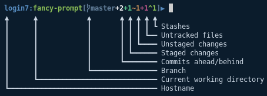

# Features

* Provides a nice colourful prompt.
* Gives you basic information about your git or svn checkout.
* Supports bash, csh and tcsh.
* Asynchronous! (zsh only)

# Screenshot



# Installation

### Zsh

Requires mafredri/zsh-async.

#### Using [zimfw](https://github.com/zimfw/zimfw)

Add the following to your `.zimrc`:

```zsh
zmodule mafredri/zsh-async --name async
zmodule lewis6991/fancy-prompt
```

Then:

```zsh
zimfw install
```

#### Manually

Add the following to your `.zshrc`:
```zsh
source path/to/fancy_prompt/prompt.zsh

```

### Bash

```bash
./install.sh
```
Add the following to your `.bashrc`:
```bash
export PROMPT_COMMAND=__prompt_command

function __prompt_command() {
    EXIT=$?
    PS1=`~/.prompt bash ${EXIT}`
}
```

### Csh/Tcsh

```bash
./install.sh
```
Add the following to your `.cshrc`:
```csh
alias precmd 'set prompt="`~/.prompt csh $?`"'
```

# Customisation

### Timeout

```bash
FANCY_PROMPT_TIMEOUT=3
```
Timeout for commands fetching SCM updates.

### Dynamic Width
```bash
FANCY_PROMPT_DYNAMIC_WIDTH=1
```
Shorten the prompt for narrow terminal windows.

### Symbols
```bash
FANCY_PROMPT_USE_SYMBOLS=1
```
Use powerline symbols. See [powerline/fonts](https://github.com/powerline/fonts).


