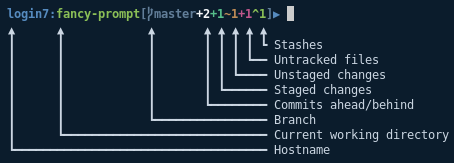

# Features

* Provides a nice colourful prompt.
* Gives you basic information about your git checkout.
* Supports bash and zsh.
* Asynchronous! (zsh only)
* Rename Tmux windows to CWD
* OSC133 Support

# Screenshot



# Installation

The prompt helper requires Bash 3.2+ on your `PATH`, including when used with Zsh.

### Zsh

Requires mafredri/zsh-async.

#### Using [zimfw](https://github.com/zimfw/zimfw)

Add the following to your `.zimrc`:

```zsh
zmodule mafredri/zsh-async --name async
zmodule lewis6991/fancy-prompt
```

Then:

```zsh
zimfw install
```

#### Manually

Add the following to your `.zshrc`:
```zsh
source "/path/to/zsh-async/async.zsh"
source "/path/to/fancy-prompt/prompt.zsh"
```

### Bash

Add the following to your `.bashrc`:
```bash
export PROMPT_COMMAND=__prompt_command

function __prompt_command() {
    local exit_code=$?
    PS1=$("/path/to/fancy-prompt/prompt" bash "$exit_code")
}
```

# Customisation

### Timeout

```bash
FANCY_PROMPT_TIMEOUT=3
```
Timeout for commands fetching SCM updates.

### Symbols
```bash
FANCY_PROMPT_USE_SYMBOLS=1
```
Use powerline symbols. See [powerline/fonts](https://github.com/powerline/fonts).

# Tests

Run the integration tests with Python 3, Git, Bash and Zsh installed:

```bash
python3 -m unittest discover -s tests
```
